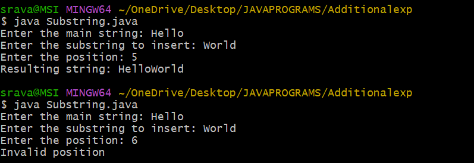
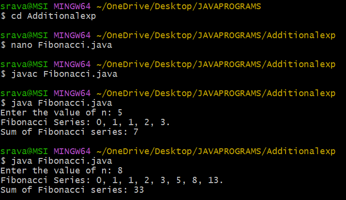
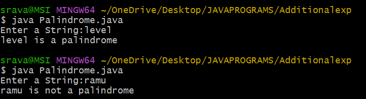
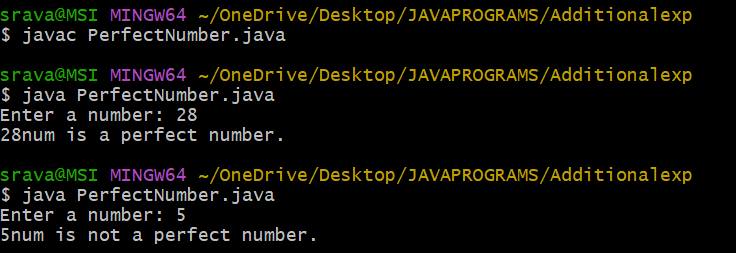
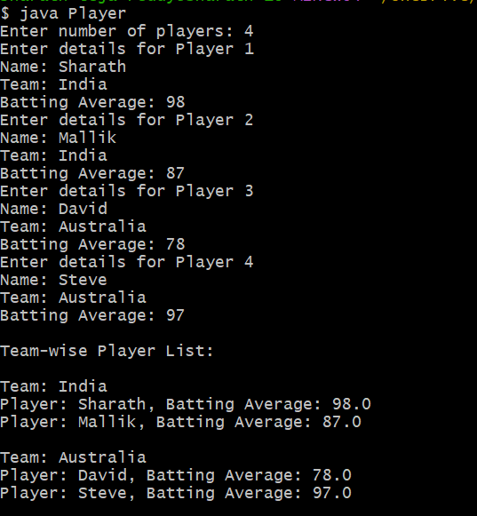

## ADDITIONAL EXPERIMENTS
## EXPERIMENT-1
## TITLE:SUBSTRING
```java
import java.util.Scanner;

class Substring {
    public static void main(String[] args) {
        Scanner sc = new Scanner(System.in);

        System.out.print("Enter the main string: ");
        String mainString = sc.nextLine();

        System.out.print("Enter the substring to insert: ");
        String subString = sc.nextLine();

        System.out.print("Enter the position: ");
        int position = sc.nextInt();

        if (position >= 0 && position <= mainString.length()) {
            String firstPart = mainString.substring(0, position);
            String secondPart = mainString.substring(position);

            String resultString = firstPart + subString + secondPart;
            System.out.println("Resulting string: " + resultString);
        } else {
            System.out.println("Invalid position");
        }
    }
}

```

## OUTPUT



## EXPERIMENT 2
## TITLE:FIBONACCI
```java
## SOURCECODE
import java.util.Scanner;

class Fibonacci {

    int n;
    int firstNumber;
    int secondNumber;
    int thirdNumber;
    int sum;
    Fibonacci(int number) {
        n = number;
        firstNumber = 0;
        secondNumber = 1;
        thirdNumber = 0;
        sum = 0;
    }
    void generate() {
        System.out.print("Fibonacci Series: ");

        int count = n;  

        while (n > 0) {
            sum += firstNumber;

            if (n == 1) {
                System.out.print(firstNumber + ".");
            } else {
                System.out.print(firstNumber + ", ");
            }

            thirdNumber = firstNumber + secondNumber;
            firstNumber = secondNumber;
            secondNumber = thirdNumber;

            n--;
        }

        System.out.println("\nSum of Fibonacci series: " + sum);
    }
    public static void main(String[] args) {
        Scanner sc = new Scanner(System.in);

        System.out.print("Enter the value of n: ");
        int number = sc.nextInt();

        Fibonacci f = new Fibonacci(number);
        f.generate();
    }
}

```


## OUTPUT




## EXPERIMENT-3
## TITLE:PALINDROME
```java
import java.util.Scanner;

class Palindrome {
    public static void main(String[] args) {
        Scanner sc = new Scanner(System.in);
        System.out.print("Enter a String:");
        String str= sc.nextLine();
        int start = 0;
        int end = str.length() - 1;
        while (start < end) {
            if (str.charAt(start) != str.charAt(end)) {
                System.out.println(str+" is not a palindrome");
                return;
            }

            start++;
            end--;
        }
        System.out.println(str+" is a palindrome");
    }
}
```

## OUTPUT




## EXPERIMENT-4
## TILE:PERFECT NUMBER
```java

import java.util.Scanner;

class PerfectNumber {
    public static void main(String[] args) {
        Scanner sc = new Scanner(System.in);

        System.out.print("Enter a number: ");
        int num = sc.nextInt();

        int sum = 0;

        for (int i = 1; i < num; i++) {
            if (num % i == 0) {
                sum += i;
            }
        }

        if (sum == num)
            System.out.println(num + "num is a perfect number.");
        else
            System.out.println(num + "num is not a perfect number.");
    }
}


```
## OUTPUT




# ADD EXP-5
## Title : Display Players in Cricket
```java
import java.util.Scanner;
class Cricket {
    String playerName;
    String teamName;
    double battingAverage;
  // Constructor
    Cricket(String playerName, String teamName, double battingAverage) {
        this.playerName = playerName;
        this.teamName = teamName;
        this.battingAverage = battingAverage;
    }
    // Method to display player details
    void display() {
        System.out.println("Player: " + playerName + 
                           ", Batting Average: " + battingAverage);
    }
}
public class Player {
    public static void main(String[] args) {
        Scanner sc = new Scanner(System.in);
        // Input number of players
        System.out.print("Enter number of players: ");
        int n = sc.nextInt();
        sc.nextLine(); // Consume newline
        // Declare array of Cricket objects
        Cricket[] players = new Cricket[n];
        // Read player details
        for (int i = 0; i < n; i++) {
            System.out.println("Enter details for Player " + (i + 1));
            System.out.print("Name: ");
            String name = sc.nextLine();
            System.out.print("Team: ");
            String team = sc.nextLine();
            System.out.print("Batting Average: ");
            double avg = sc.nextDouble();
            sc.nextLine(); // Consume newline
            players[i] = new Cricket(name, team, avg);
        }
        // Generate team-wise list
        System.out.println("\nTeam-wise Player List:");
        for (int i = 0; i < n; i++) {
            boolean teamPrinted = false;
            // Check if this team is already printed
            for (int k = 0; k < i; k++) {
                if (players[i].teamName.equalsIgnoreCase(players[k].teamName)) {
                    teamPrinted = true;
                    break;
                }
            }
            // If team not printed yet, print team and its players
            if (!teamPrinted) {
                System.out.println("\nTeam: " + players[i].teamName);
                for (int j = 0; j < n; j++) {
                    if (players[j].teamName.equalsIgnoreCase(players[i].teamName)) {
                        players[j].display();
                    }
                }
            }
        }
        sc.close();
    }
}
```

# OUTPUT


