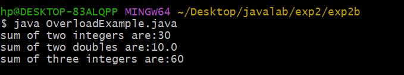
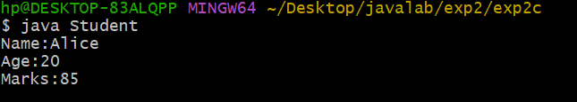

## EXPERIMENT 2A
## TITLE: MAIN METHOD
```java
class Myclass
{
void displayMessage()
{
System.out.println("welcome to java class  mechanism program");
}
int add(int a,int b)
{
return a+b;
}
}
public class Mainclass{
public static void main(String []args)
{
Myclass obj=new Myclass();
obj.displayMessage();
int result=obj.add(10,20);
System.out.println("sum of two numbers:"+result);
}
}

```


## OUTPUT


## EXPERIMENT2B
## TITLE :OVERLOADING
```java

class OverloadExample
{
int add(int a,int b)
{
return a+b;
}
double add(double a,double b)
{
return a+b;
}
int add(int a,int b,int c)
{
return a+b+c;
}
public static void main(String []args)
{
OverloadExample obj=new OverloadExample();
int sumTwoInts =obj.add(10,20);
double sumTwodoubles=obj.add(4.5,5.5);
int sumThreeInts=obj.add(10,20,30);
System.out.println("sum of two integers are:"+sumTwoInts);
System.out.println("sum of two doubles are:"+sumTwodoubles);
System.out.println("sum of three integers are:"+sumThreeInts);
}
}

```

## OUTPUT





## EXPERIMENT2C
## TITLE:Constructor
```java
class Student
{
String name;
int age;
int marks;
Student( String n,int a, int m)
{
name=n;
age=a;
marks=m;
}
void display()
{
System.out.println("Name:"+name);
System.out.println("Age:"+age);
System.out.println("Marks:"+marks);
}
public static void main (String []args)
{
Student s1=new Student("Alice",20,85);
s1.display();
}
}


```


## OUTPUT



