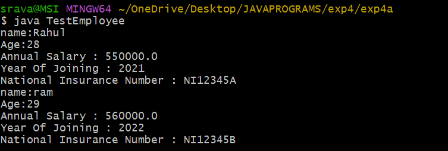

## EXPERIMENT 4A
## TITLE:SINGLE INHERITANCE
```java
class Person
{
String name;
int age;
Person(String name,int age)
{
this.name=name;
this.age=age;
}
void displayPersonDetails()
{
  System.out.println("name:"+name);
  System.out.println("Age:"+age);
}
}
class Employee extends Person {
    double annualSalary;
    int yearOfJoining;
    String nationalInsuranceNumber;

    Employee(String name, int age, double annualSalary, int yearOfJoining, String nationalInsuranceNumber) {
        super(name, age);
        this.annualSalary = annualSalary;
        this.yearOfJoining = yearOfJoining;
        this.nationalInsuranceNumber = nationalInsuranceNumber;
    }

    void displayEmployeeDetails() {
        displayPersonDetails();
        System.out.println("Annual Salary : " + annualSalary);
        System.out.println("Year Of Joining : " + yearOfJoining);
        System.out.println("National Insurance Number : " + nationalInsuranceNumber);
    }
}
public class TestEmployee {
    public static void main(String[] args) {
        Employee emp1 = new Employee("Rahul", 28, 550000, 2021, "NI12345A");
        Employee emp2=  new Employee("ram",29,560000,2022,"NI12345B");
        emp1.displayEmployeeDetails();
        emp2.displayEmployeeDetails();
    }
}

```
## OUTPUT




## EXPERIMENT 4B

## TITLE:MULTI LEVEL INHERITANCE

```java

class Bicycle {
    String pedalType;

    void showBicycleInfo() {
        System.out.println("This is a bicycle with pedals.");
    }
}
class Motorbike extends Bicycle {
    int engineCapacity;

    void showMotorbikeInfo() {
        System.out.println("This motorbike has an engine.");
    }
}
class ElectricBike extends Motorbike {
    int batteryCapacity;

    void showElectricBikeInfo() {
        System.out.println("This electric bike has an electric motor and battery.");
    }
}
public class TestVehicle {
    public static void main(String[] args) {
        ElectricBike eBike = new ElectricBike();

        eBike.pedalType = "Standard Pedals";
        eBike.engineCapacity = 250;
        eBike.batteryCapacity = 500;

        eBike.showBicycleInfo();
        eBike.showMotorbikeInfo();
        eBike.showElectricBikeInfo();
    }
}


```

## OUTPUT


