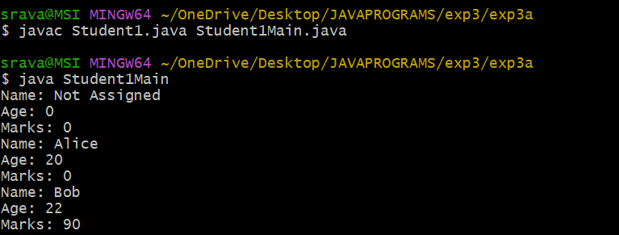
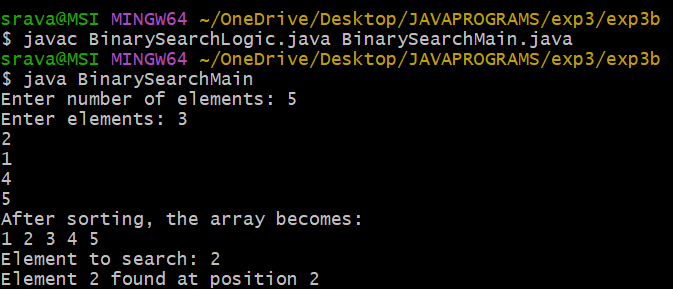

## EXPERIMENT3A

## TITLE:CONSTRUCTOR OVERLOADING
```java
class Student1 { 
String name; int age; int marks;
 Student1()
 {
        name = "Not Assigned";
        age = 0;
        marks = 0;
    }
    Student1(String n, int a) {
        name = n;
        age = a;
        marks = 0;
    }
    Student1(String n, int a, int m) {
        name = n;
        age = a;
        marks = m;
    }
    void display() {
        System.out.println("Name: " + name);
        System.out.println("Age: " + age);
        System.out.println("Marks: " + marks);
    }
}
public class Student1Main {
    public static void main(String[] args) {
        Student1 s1 = new Student1();
        Student1 s2 = new Student1("Alice", 20);
        Student1 s3 = new Student1("Bob", 22, 90);

        s1.display();
        s2.display();
        s3.display();
    }

}

```


## OUTPUT 





## EXPERIMENT3B

## TITLE: BINARY SEARCH
```java
class BinarySearchLogic {

    int binarySearch(int[] arr, int n, int key) {
        int low = 0;
        int high = n - 1;

        while (low <= high) {
            int mid = (low + high) / 2;

            if (arr[mid] == key) {
                return mid + 1;  
            } else if (arr[mid] < key) {
                low = mid + 1;
            } else {
                high = mid - 1;
            }
        }
        return -1; 
    }
}
import java.util.Scanner;

class BinarySearchMain {
    public static void main(String[] args) {
        Scanner sc = new Scanner(System.in);
        System.out.print("Enter number of elements: ");
        int n = sc.nextInt();

        int[] arr = new int[n];
        System.out.print("Enter elements: ");
        for (int i = 0; i < n; i++) {
            arr[i] = sc.nextInt();
        }
        for (int i = 0; i < n - 1; i++) {
            for (int j = i + 1; j < n; j++) {
                if (arr[i] > arr[j]) {
                    int temp = arr[i];
                    arr[i] = arr[j];
                    arr[j] = temp;
                }
            }
        }
        System.out.println("After sorting, the array becomes:");
        for (int i = 0; i < n; i++) {
            System.out.print(arr[i] + " ");
        }
        System.out.print("\nElement to search: ");
        int key = sc.nextInt();
        BinarySearchLogic obj = new BinarySearchLogic();
        int pos = obj.binarySearch(arr, n, key);
        if (pos != -1) {
            System.out.println("Element " + key + " found at position " + pos);
        } else {
            System.out.println("Element " + key + " not found in the list");
        }

        sc.close();
    }
}

```


## OUTPUT



## EXPERIMENT 3C

## TITLE : BUBBLE SORT
```java

class BubbleSort
 {
    void sort(int[] arr, int n) {
        int temp;

        for (int i = 0; i < n - 1; i++) {
            for (int j = 0; j < n - i - 1; j++)
 {
                if (arr[j] > arr[j + 1]) {
                    temp = arr[j];
                    arr[j] = arr[j + 1];
                    arr[j + 1] = temp;
                }
            }
        }
    }

    void display(int[] arr, int n) {
        System.out.println("Sorted Array in Ascending Order:");
        for (int i = 0; i < n; i++) {
            System.out.print(arr[i] + " ");
        }
    }
}
import java.util.Scanner;

public class BubbleSortMain {

    public static void main(String[] args) {

        Scanner sc = new Scanner(System.in);

        System.out.print("Enter number of elements: ");
        int n = sc.nextInt();

        int[] arr = new int[n];

        System.out.println("Enter the elements:");
        for (int i = 0; i < n; i++) {
            arr[i] = sc.nextInt();
        }

        BubbleSort bs = new BubbleSort();
        bs.sort(arr, n);
        bs.display(arr, n);

        
    }
}


```

## OUTPUT


