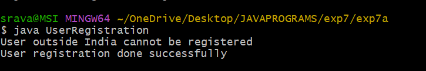
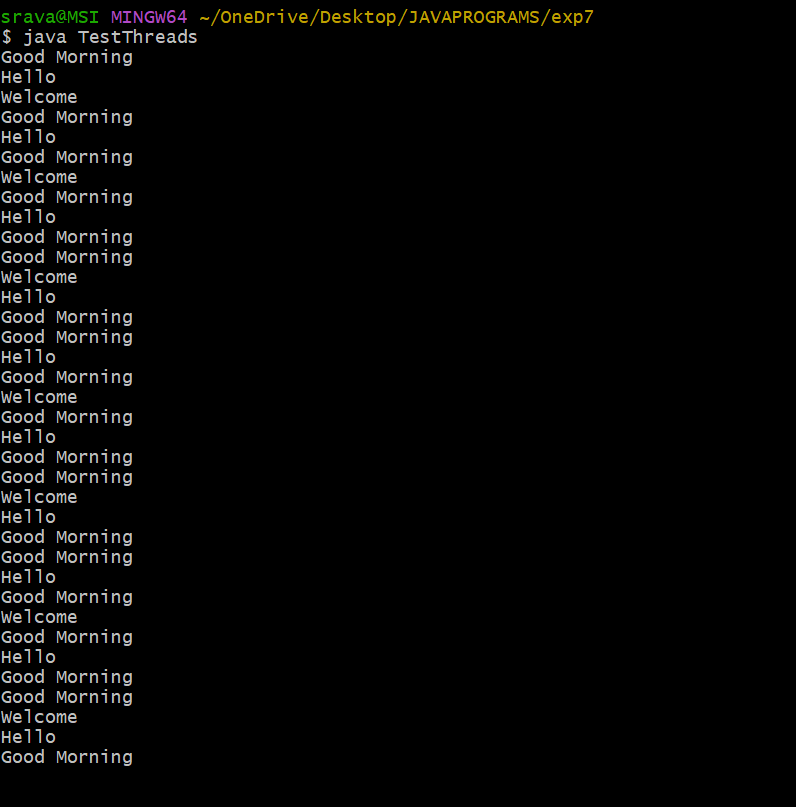
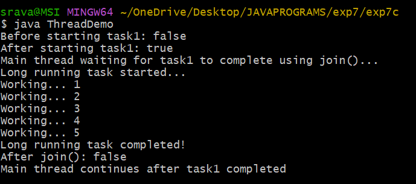

## EXPERIMENT 7A
## TITLE: USER DEFINED EXCEPTIONS
```java
class InvalidCountryException extends Exception {
    InvalidCountryException() {
        super();
    }

    InvalidCountryException(String message) {
        super(message);
    }
}

public class UserRegistration {
    void registerUser(String userName, String userCountry) throws InvalidCountryException {
        if (!userCountry.equals("India")) {
            throw new InvalidCountryException("User outside India cannot be registered");
        } else {
            System.out.println("User registration done successfully");
        }
    }

    public static void main(String[] args) {
        UserRegistration ur = new UserRegistration();

        try {
            ur.registerUser("Ravi", "USA");
        } catch (InvalidCountryException e) {
            System.out.println(e.getMessage());
        }

        try {
            ur.registerUser("Anita", "India");
        } catch (InvalidCountryException e) {
            System.out.println(e.getMessage());
        }
    }
}

```

## OUTPUT





## 7b

## TITLE:THREADS

```java


class GoodMorningThread extends Thread {
    public void run() {
        try {
            while (true) {
                System.out.println("Good Morning");
                Thread.sleep(1000);
            }
        } catch (InterruptedException e) {
            System.out.println(e);
        }
    }
}

class HelloThread extends Thread {
    public void run() {
        try {
            while (true) {
                System.out.println("Hello");
                Thread.sleep(2000);
            }
        } catch (InterruptedException e) {
            System.out.println(e);
        }
    }
}

class WelcomeThread extends Thread {
    public void run() {
        try {
            while (true) {
                System.out.println("Welcome");
                Thread.sleep(3000);
            }
        } catch (InterruptedException e) {
            System.out.println(e);
        }
    }
}

public class TestThreads {
    public static void main(String[] args) {
        GoodMorningThread t1 = new GoodMorningThread();
        HelloThread t2 = new HelloThread();
        WelcomeThread t3 = new WelcomeThread();

        t1.start();
        t2.start();
        t3.start();
    }
}ALI

```
## OUTPUT




## 7c
## TITLE:isAlive and join()

```java

class LongRunningTask extends Thread {
    public void run() {
        try {
            System.out.println("Long running task started...");
            for (int i = 1; i <= 5; i++) {
                System.out.println("Working... " + i);
                Thread.sleep(1000);
            }
            System.out.println("Long running task completed!");
        } catch (InterruptedException e) {
            System.out.println(e);
        }
    }
}

public class ThreadDemo {
    public static void main(String[] args) {
        try {
            LongRunningTask task1 = new LongRunningTask();

            System.out.println("Before starting task1: " + task1.isAlive());

            task1.start();

            System.out.println("After starting task1: " + task1.isAlive());

            System.out.println("Main thread waiting for task1 to complete using join()...");

            task1.join();

            System.out.println("After join(): " + task1.isAlive());

            System.out.println("Main thread continues after task1 completed");

        } catch (InterruptedException e) {
            System.out.println(e);
        }
    }
}
```
## OUTPUT


