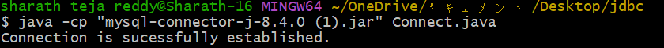
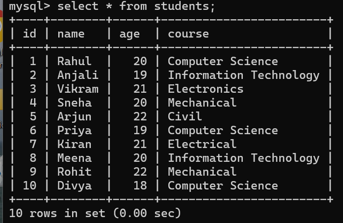
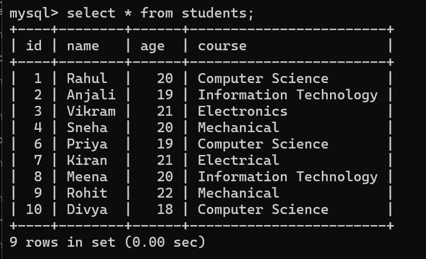

# Exp-9a
## Title : Connects a database using JDBC
```java
import java.sql.Connection;
import java.sql.DriverManager;
import java.sql.Statement;

public class Connect {

    public static void main(String[] args) {

        // Database credentials
        String url = "jdbc:mysql://localhost:3306/sharath";
        String username = "root";
        String password = "Sharath@16";   // Change as per your MySQL password

        try {
            // Step 1: Load JDBC Driver (Optional in latest versions)
            Class.forName("com.mysql.cj.jdbc.Driver");

            // Step 2: Establish Connection
            Connection con = DriverManager.getConnection(url, username, password);

                if (con == null)
                System.out.println("Connection is not established");
                else
                System.out.println("Connection is sucessfully established.");
            con.close();

        } catch (Exception e) {
            System.out.println(e);
        }
    }
}
```
# OUTPUT


# Exp-9b
## Title : Create using JDBC
```java
import java.sql.Connection;
import java.sql.DriverManager;
import java.sql.Statement;

public class Insert {

    public static void main(String[] args) {

        String url = "jdbc:mysql://localhost:3306/sharath";
        String username = "root";
        String password = "Sharath@16";   // Change to your MySQL password

        try {
            // Load Driver
            Class.forName("com.mysql.cj.jdbc.Driver");

            // Establish Connection
            Connection con = DriverManager.getConnection(url, username, password);

            // Create Statement
            Statement stmt = con.createStatement();

            // Insert 10 records in single query
            String query = "INSERT INTO students (name, age, course) VALUES "
                    + "('Rahul', 20, 'Computer Science'),"
                    + "('Anjali', 19, 'Information Technology'),"
                    + "('Vikram', 21, 'Electronics'),"
                    + "('Sneha', 20, 'Mechanical'),"
                    + "('Arjun', 22, 'Civil'),"
                    + "('Priya', 19, 'Computer Science'),"
                    + "('Kiran', 21, 'Electrical'),"
                    + "('Meena', 20, 'Information Technology'),"
                    + "('Rohit', 22, 'Mechanical'),"
                    + "('Divya', 18, 'Computer Science')";

            // Execute Query
            int rows = stmt.executeUpdate(query);

            System.out.println(rows + " records inserted successfully!");

            // Close Connection
            stmt.close();
            con.close();

        } catch (Exception e) {
            System.out.println(e);
        }
    }
}
```
# OUTPUT


# Exp-9c
## Title : Delete using JDBC
```java
import java.sql.Connection;
import java.sql.DriverManager;
import java.sql.Statement;

public class DeleteStudent {

    public static void main(String[] args) {

        String url = "jdbc:mysql://localhost:3306/sharath";
        String username = "root";
        String password = "Sharath@16";   // Change accordingly

        try {
            Class.forName("com.mysql.cj.jdbc.Driver");

            Connection con = DriverManager.getConnection(url, username, password);

            Statement stmt = con.createStatement();

            String query = "DELETE FROM students WHERE id=5";

            int rows = stmt.executeUpdate(query);

            System.out.println(rows + " record(s) deleted successfully!");

            stmt.close();
            con.close();

        } catch (Exception e) {
            System.out.println(e);
        }
    }
}
```
# OUTPUT

