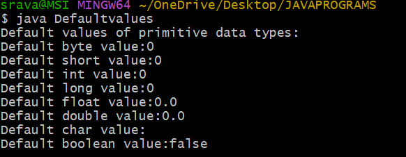
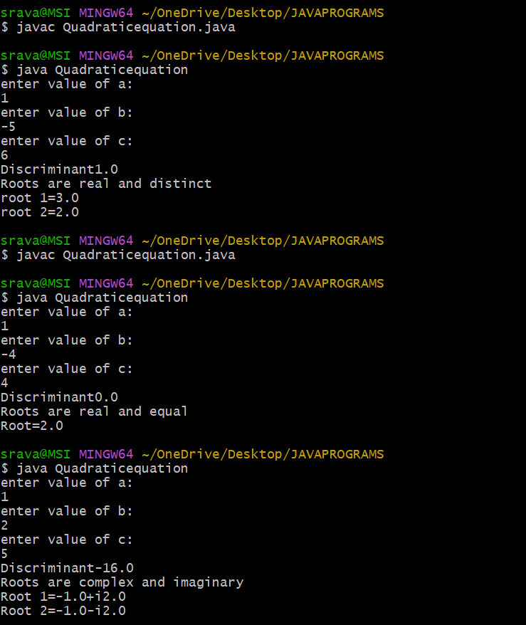
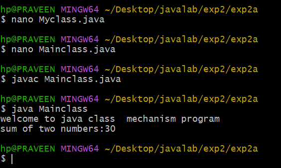
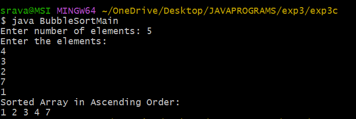

# JAVA_LAB
## Experiment 1a
## TITLE:PRIMITIVE DATA TYPES
``` java
public class Defaultvalues{
byte b;
short s;
int i;
long l;
float f;
double d;
char c;
boolean bool;
public static void main(String []args){
Defaultvalues obj=new Defaultvalues();
System.out.println("Default values of primitive data types:");
System.out.println("Default byte value:"+obj.b);
System.out.println("Default short value:"+obj.s);
System.out.println("Default int value:"+obj.i);
System.out.println("Default long value:"+obj.l);
System.out.println("Default float value:"+obj.f);
System.out.println("Default double value:"+obj.d);
System.out.println("Default char value:"+obj.c);
System.out.println("Default boolean value:"+obj.bool);
}
}

```


## OUTPUT




## Experiment 1b
## Quadratic equation
```java


import java.util.Scanner;
class Quadraticequation{
public static void main(String[]args)
{
Scanner Sc=new Scanner(System.in);
double a,b,c,D;
System.out.println("enter value of a:");
a=Sc.nextDouble();
System.out.println("enter value of b:");
b=Sc.nextDouble();
System.out.println("enter value of c:");
c=Sc.nextDouble();
D=b*b-4*a*c;
System.out.println("Discriminant"+D);
if(D>0)
{
double root1=(-b+Math.sqrt(D))/(2*a);
double root2=(-b-Math.sqrt(D))/(2*a);
System.out.println("Roots are real and distinct");
System.out.println("root 1="+root1);
System.out.println("root 2="+root2);
}
else if(D==0)
{
double root=-b/(2*a);
System.out.println("Roots are real and equal");
System.out.println("Root="+root);
}
else
{
double real=-b/(2*a);
double imaginary=Math.sqrt(-D)/(2*a);
System.out.println("Roots are complex and imaginary");
System.out.println("Root 1="+real+"+i"+imaginary);
System.out.println("Root 2="+real+"-i"+imaginary);
}
}
}


```

## OUTPUT




## EXPERIMENT 2A
## TITLE: MAIN METHOD
```java
class Myclass
{
void displayMessage()
{
System.out.println("welcome to java class  mechanism program");
}
int add(int a,int b)
{
return a+b;
}
}
public class Mainclass{
public static void main(String []args)
{
Myclass obj=new Myclass();
obj.displayMessage();
int result=obj.add(10,20);
System.out.println("sum of two numbers:"+result);
}
}

```


## OUTPUT





## EXPERIMENT2B
## TITLE :OVERLOADING
```java

class OverloadExample
{
int add(int a,int b)
{
return a+b;
}
double add(double a,double b)
{
return a+b;
}
int add(int a,int b,int c)
{
return a+b+c;
}
public static void main(String []args)
{
OverloadExample obj=new OverloadExample();
int sumTwoInts =obj.add(10,20);
double sumTwodoubles=obj.add(4.5,5.5);
int sumThreeInts=obj.add(10,20,30);
System.out.println("sum of two integers are:"+sumTwoInts);
System.out.println("sum of two doubles are:"+sumTwodoubles);
System.out.println("sum of three integers are:"+sumThreeInts);
}
}

```

## OUTPUT


## EXPERIMENT2C
## TITLE:Constructor
```java
class Student
{
String name;
int age;
int marks;
Student( String n,int a, int m)
{
name=n;
age=a;
marks=m;
}
void display()
{
System.out.println("Name:"+name);
System.out.println("Age:"+age);
System.out.println("Marks:"+marks);
}
}
public class Main{
public static void main (String []args)
{
Student s1=new Student("Alice",20,85);
s1.display();
}
}


```


## OUTPUT


## ADDITIONAL EXPERIMENTS
## EXPERIMENT 1
## TITLE:FIBONACCI
```java
## SOURCECODE
import java.util.Scanner;

class Fibonacci {

    int n;
    int firstNumber;
    int secondNumber;
    int thirdNumber;
    int sum;
    Fibonacci(int number) {
        n = number;
        firstNumber = 0;
        secondNumber = 1;
        thirdNumber = 0;
        sum = 0;
    }
    void generate() {
        System.out.print("Fibonacci Series: ");

        int count = n;  

        while (n > 0) {
            sum += firstNumber;

            if (n == 1) {
                System.out.print(firstNumber + ".");
            } else {
                System.out.print(firstNumber + ", ");
            }

            thirdNumber = firstNumber + secondNumber;
            firstNumber = secondNumber;
            secondNumber = thirdNumber;

            n--;
        }

        System.out.println("\nSum of Fibonacci series: " + sum);
    }
    public static void main(String[] args) {
        Scanner sc = new Scanner(System.in);

        System.out.print("Enter the value of n: ");
        int number = sc.nextInt();

        Fibonacci f = new Fibonacci(number);
        f.generate();
    }
}

```


## OUTPUT


## EXPERIMENT3A

## TITLE:CONSTRUCTOR OVERLOADING
```java
class Student1 { 
String name; int age; int marks;
 Student1()
 {
        name = "Not Assigned";
        age = 0;
        marks = 0;
    }
    Student1(String n, int a) {
        name = n;
        age = a;
        marks = 0;
    }
    Student1(String n, int a, int m) {
        name = n;
        age = a;
        marks = m;
    }
    void display() {
        System.out.println("Name: " + name);
        System.out.println("Age: " + age);
        System.out.println("Marks: " + marks);
    }
}
public class Student1Main {
    public static void main(String[] args) {
        Student1 s1 = new Student1();
        Student1 s2 = new Student1("Alice", 20);
        Student1 s3 = new Student1("Bob", 22, 90);

        s1.display();
        s2.display();
        s3.display();
    }

}

```


## OUTPUT 


## EXPERIMENT3B

## TITLE: BINARY SEARCH
```java
class BinarySearchLogic {

    int binarySearch(int[] arr, int n, int key) {
        int low = 0;
        int high = n - 1;

        while (low <= high) {
            int mid = (low + high) / 2;

            if (arr[mid] == key) {
                return mid + 1;  
            } else if (arr[mid] < key) {
                low = mid + 1;
            } else {
                high = mid - 1;
            }
        }
        return -1; 
    }
}
import java.util.Scanner;

class BinarySearchMain {
    public static void main(String[] args) {
        Scanner sc = new Scanner(System.in);
        System.out.print("Enter number of elements: ");
        int n = sc.nextInt();

        int[] arr = new int[n];
        System.out.print("Enter elements: ");
        for (int i = 0; i < n; i++) {
            arr[i] = sc.nextInt();
        }
        for (int i = 0; i < n - 1; i++) {
            for (int j = i + 1; j < n; j++) {
                if (arr[i] > arr[j]) {
                    int temp = arr[i];
                    arr[i] = arr[j];
                    arr[j] = temp;
                }
            }
        }
        System.out.println("After sorting, the array becomes:");
        for (int i = 0; i < n; i++) {
            System.out.print(arr[i] + " ");
        }
        System.out.print("\nElement to search: ");
        int key = sc.nextInt();
        BinarySearchLogic obj = new BinarySearchLogic();
        int pos = obj.binarySearch(arr, n, key);
        if (pos != -1) {
            System.out.println("Element " + key + " found at position " + pos);
        } else {
            System.out.println("Element " + key + " not found in the list");
        }

        sc.close();
    }
}

```


## OUTPUT


## EXPERIMENT 3C

## TITLE : BUBBLE SORT
```java

class BubbleSort
 {
    void sort(int[] arr, int n) {
        int temp;

        for (int i = 0; i < n - 1; i++) {
            for (int j = 0; j < n - i - 1; j++)
 {
                if (arr[j] > arr[j + 1]) {
                    temp = arr[j];
                    arr[j] = arr[j + 1];
                    arr[j + 1] = temp;
                }
            }
        }
    }

    void display(int[] arr, int n) {
        System.out.println("Sorted Array in Ascending Order:");
        for (int i = 0; i < n; i++) {
            System.out.print(arr[i] + " ");
        }
    }
}
import java.util.Scanner;

public class BubbleSortMain {

    public static void main(String[] args) {

        Scanner sc = new Scanner(System.in);

        System.out.print("Enter number of elements: ");
        int n = sc.nextInt();

        int[] arr = new int[n];

        System.out.println("Enter the elements:");
        for (int i = 0; i < n; i++) {
            arr[i] = sc.nextInt();
        }

        BubbleSort bs = new BubbleSort();
        bs.sort(arr, n);
        bs.display(arr, n);

        
    }
}


```

## OUTPUT




